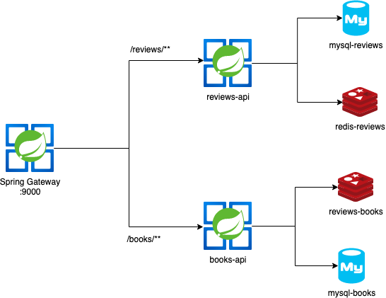
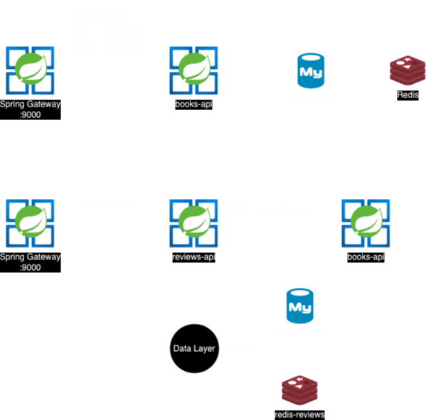
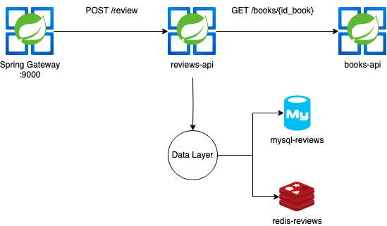
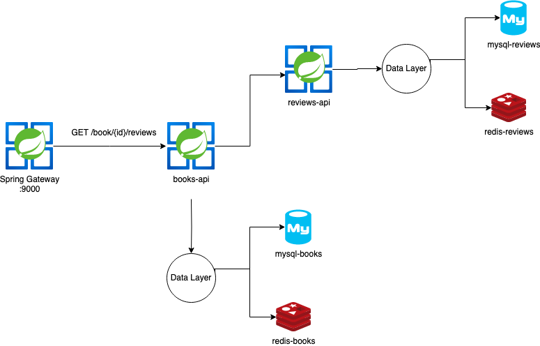
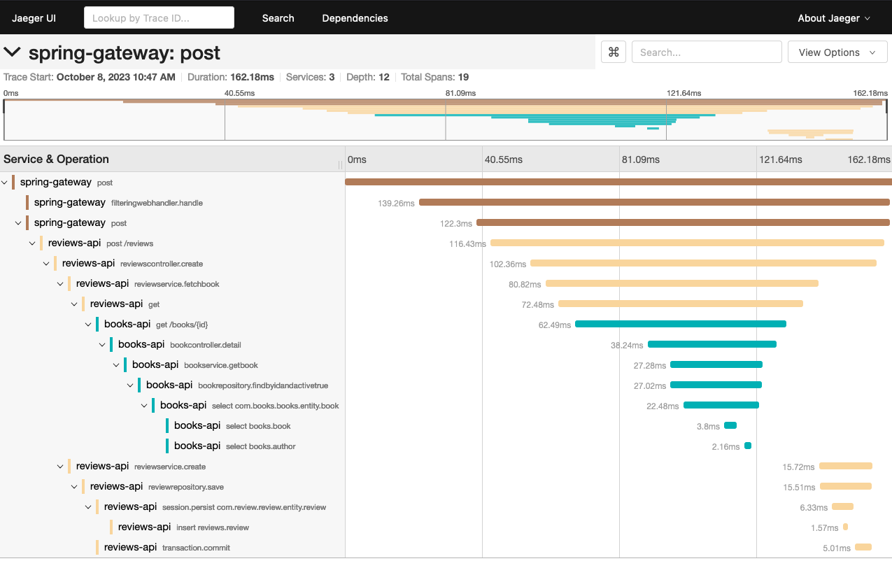
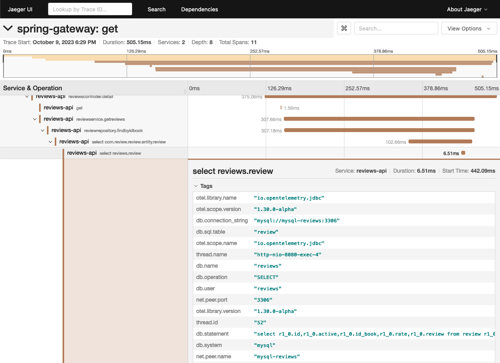
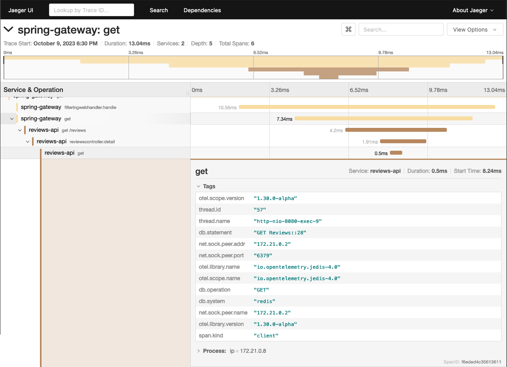
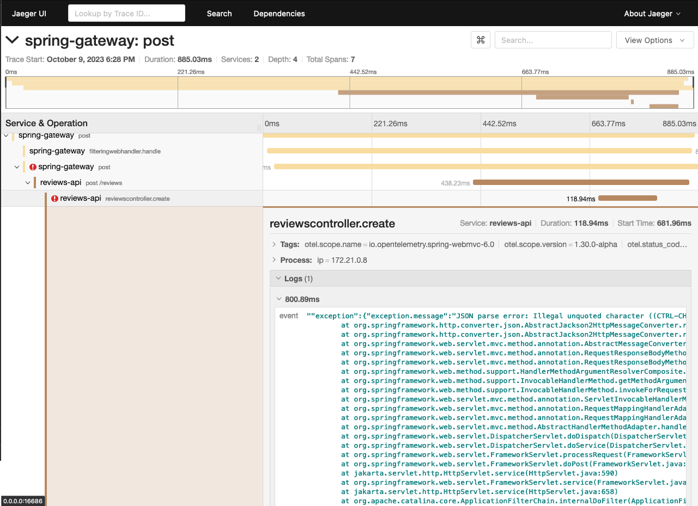

# Open Telemetry Auto Traces - Example

* [Feign HTTP Client](https://docs.spring.io/spring-cloud-openfeign/docs/current/reference/html/)
* [HTTP Client - Spring Cloud Gateway](https://spring.io/projects/spring-cloud-gateway)
* [@WithSpan and @SpanAttribute Annotations](https://opentelemetry.io/docs/instrumentation/java/automatic/annotations/) 
* [Spring Data Redis Operations / Jedis](https://spring.io/projects/spring-data-redis)
* [Hibernate Operations / Spring Data JPA](https://spring.io/projects/spring-data-jpa)

# Project Architecture

## Isolated Services - Spring Cloud Gateway Routes



## Isolated Services - REST Methods



## Isolated Services - Data Layers




## Integrated Services - Books / Reviews




# Example Trace - Autoconfiguration 

## Dockerfile

```Dockerfile
FROM openjdk:21-jdk

WORKDIR /app

COPY .mvn .mvn
COPY mvnw .
COPY pom.xml .
COPY src src

RUN ./mvnw clean package


# ADD OTEL Java Agent
ADD https://github.com/open-telemetry/opentelemetry-java-instrumentation/releases/latest/download/opentelemetry-javaagent.jar opentelemetry-javaagent.jar

# Add Agent Path on JAVA_TOOL_OPTIONS
ENV JAVA_TOOL_OPTIONS="-javaagent:./opentelemetry-javaagent.jar"

RUN mv target/*.jar app.jar

EXPOSE 8080

CMD ["java", "-jar", "app.jar"]
```

## Maven Dependencies

```xml
		<dependency>
			<groupId>io.opentelemetry.instrumentation</groupId>
			<artifactId>opentelemetry-instrumentation-annotations</artifactId>
			<version>1.30.0</version>
		</dependency>
```

## Environment Variables 

```yaml
    // ... 
    environment: 
      OTEL_SERVICE_NAME: books-api
      OTEL_TRACES_EXPORTER: zipkin
      OTEL_EXPORTER_ZIPKIN_ENDPOINT: http://jaeger:9411/api/v2/spans
      OTEL_METRICS_EXPORTER: none
    // ...
```

## Annotate with @WithSpan and @SpanAttribute

```java
    @WithSpan
    public BookResponse fetchBook(@SpanAttribute("id_book") Long id_book) {
        try {
            return bookClient.getBookById(id_book);
        } catch (Exception e) {
            System.out.println(e.getMessage());
            return null;
        }
    }

    @WithSpan
    @Cacheable(value = "Reviews", key = "#id_book")
    public List<Review> getReviews(@SpanAttribute("id_book") Long id_book) {
        List<Review> reviews = repository.findByIdBook(id_book);
        return reviews;
    }
```

## Test Requests 

```bash
❯ curl --request POST \
  --url http://0.0.0.0:9000/author \
  --header 'Content-Type: application/json' \
  --header 'User-Agent: insomnia/8.2.0' \
  --data '{
        "name": "Matheus Fidelis",
        "location": "Brazil",
        "birth": 1995
}' -i

HTTP/1.1 201 Created
transfer-encoding: chunked
Content-Type: application/json
Date: Mon, 09 Oct 2023 21:24:03 GMT

{"id":4,"name":"Matheus Fidelis","location":"Brazil","birth":1995,"active":true}
```

```bash 
curl --request POST \
  --url http://0.0.0.0:9000/books \
  --header 'Content-Type: application/json' \
  --header 'User-Agent: insomnia/8.2.0' \
  --data '{
        "name": "As melhores do Ari Toledo",
        "year": 2012,
        "author_id": 4
}' -i

HTTP/1.1 201 Created
transfer-encoding: chunked
Content-Type: application/json
Date: Mon, 09 Oct 2023 21:26:42 GMT

{"id":28,"name":"As melhores do Ari Toledo","year":2012,"active":true,"author":{"id":4,"name":"Matheus Fidelis","location":"Brazil","birth":1995,"active":true}}
```

```bash 
curl --request POST \
  --url http://0.0.0.0:9000/reviews \
  --header 'Content-Type: application/json' \
  --header 'User-Agent: insomnia/8.2.0' \
  --data '{
        "book_id": 28 ,
        "rate": 5,
        "review": "kkkkkkkk top dms slc man"
}' -i
HTTP/1.1 201 Created
transfer-encoding: chunked
Content-Type: application/json
Date: Mon, 09 Oct 2023 21:29:12 GMT

{"id":181,"rate":5.0,"idBook":28,"review":"kkkkkkkk top dms slc man","active":true
```


```bash
❯ curl --request GET \
  --url 'http://0.0.0.0:9000/reviews?book=28' \
  --header 'User-Agent: insomnia/8.2.0' -i
HTTP/1.1 200 OK
transfer-encoding: chunked
Content-Type: application/json
Date: Mon, 09 Oct 2023 21:30:15 GMT

[{"id":180,"rate":5.0,"review":"kkkkkkkk top dms slc man"},{"id":181,"rate":5.0,"review":"kkkkkkkk top dms slc man"}]
```

## Example Traces








